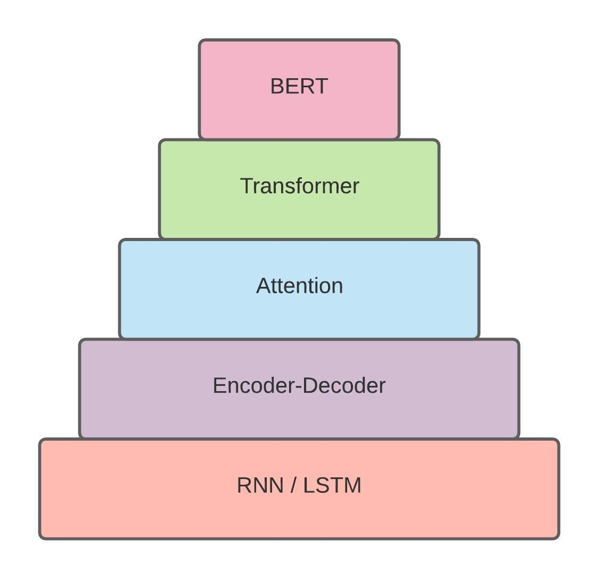

# Transformers & BERT (in progress)

The appearance of the BERT (*Bidiractional Encoder Representaions from Transformers*) model in 2018 has certainly been an infelection point in the NLP world. "BERT models have demonstrated a very sophisticated knowledge of language, achieving human-level performance on __certain tasks__" [[1]](#1). BERT is a pre-trained model (trained by Google on a huge corpus), and can be fine-tuned and repurposed for different NLP tasks. BERT was first introduced by Google AI Language in 2019. See [[2]](#2) for the paper link and [[3]](#3) for the announcement made by Google about open sourcing BERT. 

The BERT model is a result of a series of continuous progress in utilizing deep learning models for NLP tasks. Figure 1 shows the hierarchy of advancements  leading to BERT. I got the idea of this figure from [[4]](#4) written by Chris McCormick. So the credit shoud go to him! He called such an hierarchy the BERT mountain, however, I'd like to call it the BERT Cake here as it more looks like a cake to me!

  
   
   <em> Fig1: The BERT Cake </em>

  

Understanding the lower levels of the BERT cake, on which the BERT was evolved, seems necessary before diving deep into BERT. I would highly recommend to go over [[5]](#5) and [[6]](#6), blogs that contains amazing illustrations around these concepts, to have an overview of the necessary concepts.

## Transformer
The transformer was first proposed in a paper titled "Attention is All you Need" [[7]](#7). The Harvard nlp group has published a notebook containing the full implementation of the paper [[8]](#8).

The transfomer is a newer version of sequence to sequence transduction model (e.g. machine translation model - figure 2). Prior to the invention of the transformer, the dominant sequence transduction models were based on recurrent encoder and decoder networks, connected via attention mechanism ([[5]](#5),[[9]](#9),[[10]](#10)). 

  
   
  <em> Fig2: Sequence Transduction Model (source: [5])</em>

  

Using recurrent networks as endoer an deocder in transduction models leads to some limitations. As we know, hidden states in the RNN has temporal (time) dependencies to one another, meaning that *h(t)* would be pending *h(t-1)* computation and so on. This makes it imposible to benefit much from parallelizing operations during the training; consequently, training RNN based transduction models are expensive in both time and memory. The Transformer, however, dispenses with recurrence and instead relies entirely on an attention mechanism to draw global dependenciecs between input and output. As mentioned in the main paper [[7]](#7): "The Tramsformer allows for significantly more parallelization and can reach a new state of the art in translation quality after being trained for as little as twelve hours on eight P100 GPUs". As claimed by the authors: "The Transformer is the first transduction model relying entirely on self-attention to compute representations of its input and ouput without using sequence-aligned RNNs or convolution".

### The Transformer Architecture

## References
<a id="1">[1]</a> 
Chris McCormick. The Inner Workings of BERT (2020)

<a id="2">[2]</a>
[Bert: Pre-training of deep bidirectional transformers for language understanding](https://arxiv.org/pdf/1810.04805.pdf)

<a id="3">[3]</a>
[Open Sourcing BERT: State-of-the-Art Pre-training for Natural Language Processing](https://ai.googleblog.com/2018/11/open-sourcing-bert-state-of-art-pre.html)

<a id="4">[4]</a>
[BERT Research - Ep. 1 - Key Concepts & Sources](http://mccormickml.com/2019/11/11/bert-research-ep-1-key-concepts-and-sources/)

<a id="5">[5]</a>
[Visualizing A Neural Machine Translation Model (Mechanics of Seq2seq Models With Attention)](https://jalammar.github.io/visualizing-neural-machine-translation-mechanics-of-seq2seq-models-with-attention/)

<a id="6">[6]</a>
[The Illustrated Transformer](https://jalammar.github.io/illustrated-transformer/)

<a id="7">[7]</a>
[Attention is All You Need](https://arxiv.org/abs/1706.03762)

<a id="8">[8]</a>
[The Annotated Transformer](http://nlp.seas.harvard.edu/2018/04/03/attention.html)

<a id="9">[9]</a>
[Neural Machine Translation by Jointly Learning to Align and Translate](https://arxiv.org/abs/1409.0473)

<a id="10">[10]</a>
[Effective Approaches to Attention-based Neural Machine Translation](https://arxiv.org/abs/1508.04025)
